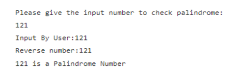
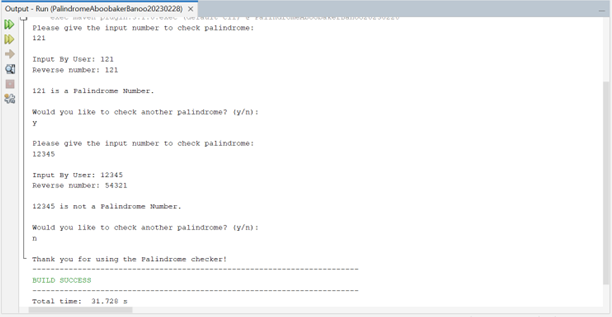
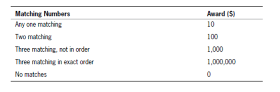
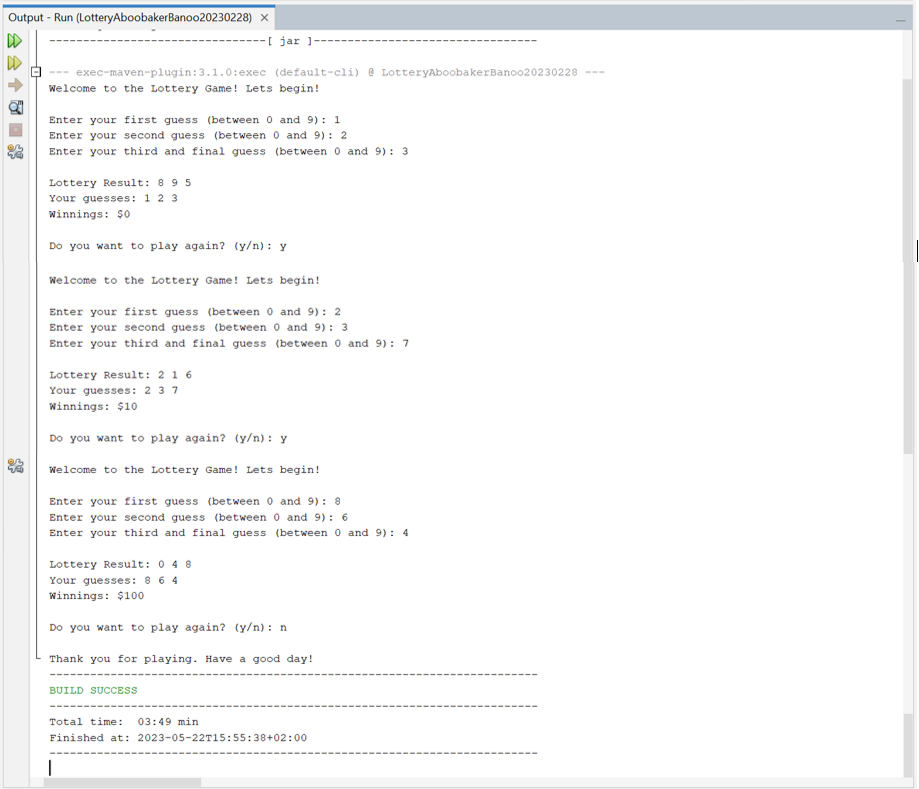
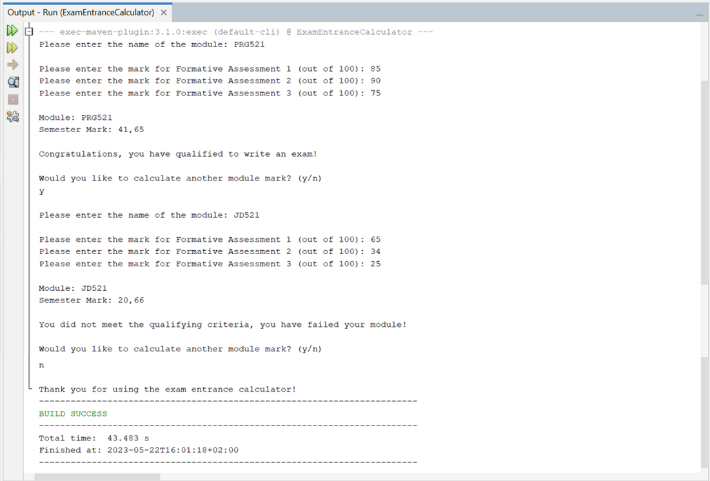
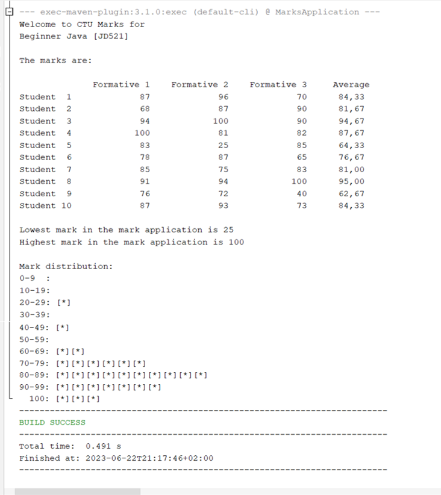

# BeginnerJavaConsoleApplications
This repository showcases small Java console applications for beginners

## Context
This repository showcases small Java console applications that I have worked on and completed.

## Table of Contents
- [Beginner Java Console Applications](#beginnerjavaconsoleapplications)
- [Context](#context)
- [Table of Contents](#table-of-contents)
- [Palindrome Checker](#palindrome-checker)
- [Lottery Game](#lottery-game)
- [Exam Enterence Calculator](#exam-enterence-calculator)
- [Marks Application](#marks-application)
- [Banking App](#jd521fa1-banking-app)

## Palindrome Checker
### Overview
Palindrome is a word, verse, or sentence (such as "Able was I ere I saw Elba") or a number (such as 1881) that reads the same backward or forward. Create a Java application to check if a number provided by the user is a Palindrome or not. Give appropriate messages to the user.  
#### See sample output:

### Demonstrating functionality:

## Lottery Game
### Overview
Create a lottery game application. Generate three random numbers, each between 0 and 9. Allow the user to guess three numbers. Compare each of the user’s guesses to the three random numbers and display a message that includes the user’s guess, the randomly determined three-digit number, and the amount of money the user has won as follows:  

 
Make certain that your application accommodates repeating digits. For example, if a user guesses 1, 2, and 3, and the randomly generated digits are 1, 1, and 1, do not give the user credit for three correct guesses—just one.

### Demonstrating functionality:

## Exam Enterence Calculator
### Overview
Write a Java console application for an Exam Entrance Calculator that allows a user to input the name of a module and the marks obtained in its three formative assessments (each worth 16.66%). The application should then calculate the student's semester mark and output whether the student has qualified to write the exam or not. Use constants to store the weight of each assessment. The pass mark for the module to write an exam is 30%. 
  
Use the following examples to achieve your App:  
If a user has the following marks:  
FA1 = 65%  
FA2= 34%  
FA3 = 25%  
 
You need to convert the mark received to the weight of the assessments.  
FA1 = 65 / 100 * 16.66  
FA2 = 34 / 100 * 16.66  
FA3 = 25 / 100 * 16.66  
 
These should be your implementation.  
Calculations: Assuming you have a variable name as follows:  
finalMark: FA1 + HA2 + FA3  
Then use the final mark to determine if the student has qualified or not.  
 
Your application should display the following prompts to the user:  
"Please enter the name of the module: "  
"Please enter the mark for Formative Assessment 1 (out of 100): "  
"Please enter the mark for Formative Assessment 2 (out of 100): "  
"Please enter the mark for Formative Assessment 3 (out of 100): "  
 
Assume that the user enters valid integer marks for each assessment.  
Display an appropriate message for the two conditions, if the student gets 30% or more display “Congratulations you have qualified to write an exam” if not “You did not meet the qualifying criteria, you have failed your module” 

### Demonstrating functionality:

## Marks Application
### Overview
You have been tasked by CTU training solutions to develop a Marks Application for the Facilitators using Java programming language, that will allow facilitators to maintain student’s marks during exams. The application will show students' reports per module, including the marks, class average, lowest marks, highest marks, and a mark distribution bar chart. 

- The use of a two-dimensional array should be used to store students’ marks for several tests
- The use of a constructor should be used to initialize course names and marks
- The use methods (minimum 5) should be used to implement the functionality of the application, including set and get methods
- All calculations (average, Lowest, and highest mark) should be calculated based on the student marks
- The mark distribution should be precise as the student marks
- The application running without errors/ Use of comments in the coding

### Demonstrating functionality:

## JD521FA1 (Banking App)
### Overview
CTU Training Solutions has launched a new online bank, and you have been assigned to develop a Java application to facilitate banking transactions. The application should enable users to deposit and withdraw funds, as well as save and earn interest based on the duration and amount of their savings. 
To calculate the interest earned by users' savings, the following table should be implemented: 

| Savings Amount Range | Savings Duration | Interest Rate |
|----------------------|------------------|---------------|
| R100 to R500         | 1 month          | 0.5%          |
| R600 to R1000        | 1 month          | 2%            |
| Over R1000           | 1 month          | 5%            |

When the client saves money, the table above in the scenario must be used to perform calculations.

Create a basic Java Application that will help CTU banking clients to perform basic transactions. The Application should meet the following menu requirements: 
- Display all account details
- Deposit the amount
- Save the amount
- Withdraw the amount
- Exit

### Demonstrating functionality
#### First run of the application - Menu with all required options:

#### Program correctly performs deposits:

#### Program correctly performs savings:
a.     
b.   

#### Program correctly performs withdrawals:

#### Program correctly exits when selected:

### Demonstrating input validation
#### Program properly validates input for deposit amounts
If the user inputs a negative number or text, an error message will be displayed:  

#### Program properly validates input for savings amounts
a. For the savings amount, if the user inputs a negative number, an error message will be displayed:  

b. For the savings amount, if the user inputs some text, an error message will be displayed:  

c. For the number of months, if the user inputs a negative number or some text, an error message will be displayed:  

#### Program properly validates input for withdrawal amounts
a. If the user wants to withdraw an amount that is greater than their account balance, an error message will be displayed:  

b. If the user inputs a negative number or some text, an error message will be displayed:  

### Demonstrating output clarity
#### Program provides clear instructions for user input:

#### Program outputs clear messages for successful deposits:

#### Program outputs clear messages for successful savings:

#### Program outputs clear messages for successful withdrawals:

### Demonstrating creativity
#### Program includes additional features beyond the basic requirements
a. With option ‘A’, the user can Check their account balance:  

b. With option ‘E’, the use can check their Previous transaction:  

c. Balance starts at R0 (no money in the account):  

d. The users Previous transaction is null if no transactions have taken place:  

