# BeginnerJavaConsoleApplications
This repository showcases small Java console applications for beginners

## Context
This repository showcases small Java console applications that I have worked on and completed.

## Table of Contents
- [Beginner Java Console Applications](#beginnerjavaconsoleapplications)
- [Context](#context)
- [Table of Contents](#table-of-contents)
- [Palindrome Checker](#palindrome-checker)
- [Exam Enterence Calculator](#exam-enterence-calculator)
- [Lottery Game](#lottery-game)

- [Marks Application](#marks-application)
- [Banking App](#jd521fa1-banking-app)

## Palindrome Checker
### Overview
Palindrome is a word, verse, or sentence (such as "Able was I ere I saw Elba") or a number (such as 1881) that reads the same backward or forward. Create a Java application to check if a number provided by the user is a Palindrome or not. Give appropriate messages to the user.  
See sample output:  

### Demonstrating functionality:

## Exam Enterence Calculator
### Overview

## Lottery Game
### Overview

## Marks Application
### Overview

## JD521FA1 (Banking App)
### Overview
CTU Training Solutions has launched a new online bank, and you have been assigned to develop a Java application to facilitate banking transactions. The application should enable users to deposit and withdraw funds, as well as save and earn interest based on the duration and amount of their savings. 
To calculate the interest earned by users' savings, the following table should be implemented: 

| Savings Amount Range | Savings Duration | Interest Rate |
|----------------------|------------------|---------------|
| R100 to R500         | 1 month          | 0.5%          |
| R600 to R1000        | 1 month          | 2%            |
| Over R1000           | 1 month          | 5%            |

When the client saves money, the table above in the scenario must be used to perform calculations.

Create a basic Java Application that will help CTU banking clients to perform basic transactions. The Application should meet the following menu requirements: 
- Display all account details
- Deposit the amount
- Save the amount
- Withdraw the amount
- Exit

### Demonstrating functionality
#### First run of the application - Menu with all required options:
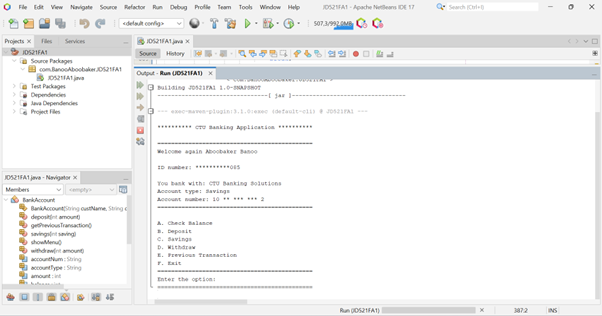

#### Program correctly performs deposits:
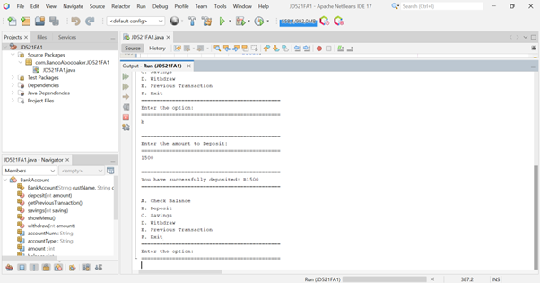

#### Program correctly performs savings:
a.   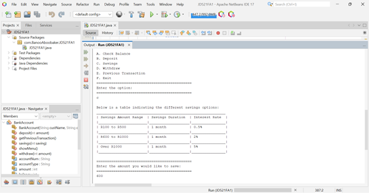
b.   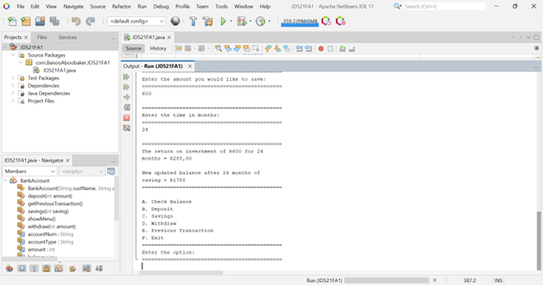

#### Program correctly performs withdrawals:
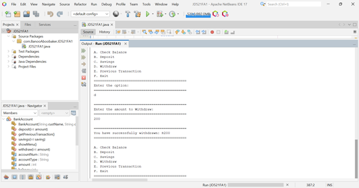

#### Program correctly exits when selected:
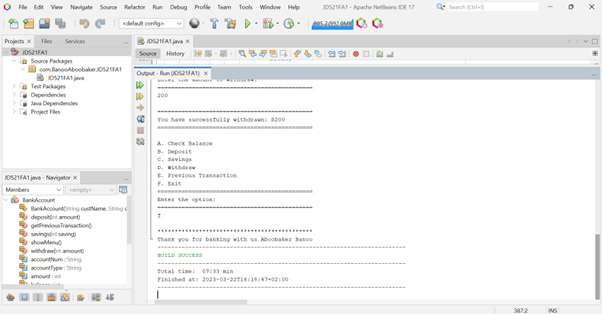

### Demonstrating input validation
#### Program properly validates input for deposit amounts
If the user inputs a negative number or text, an error message will be displayed:  
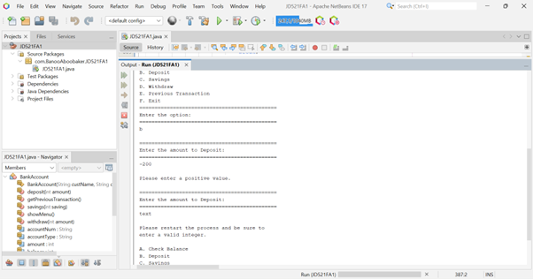

#### Program properly validates input for savings amounts
a. For the savings amount, if the user inputs a negative number, an error message will be displayed:  
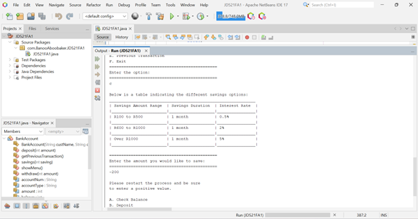

b. For the savings amount, if the user inputs some text, an error message will be displayed:  
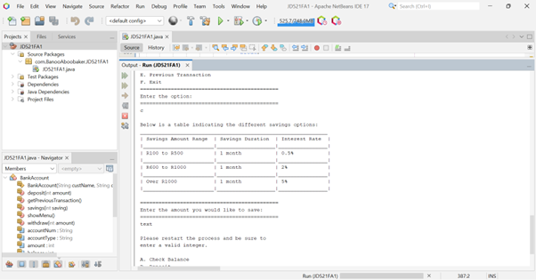

c. For the number of months, if the user inputs a negative number or some text, an error message will be displayed:  
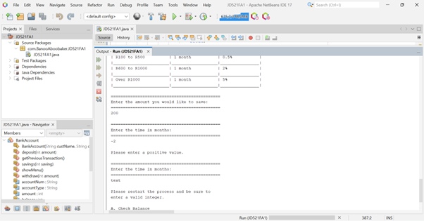

#### Program properly validates input for withdrawal amounts
a. If the user wants to withdraw an amount that is greater than their account balance, an error message will be displayed:  
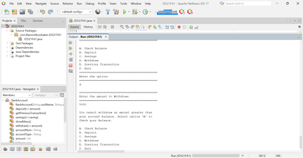

b. If the user inputs a negative number or some text, an error message will be displayed:  
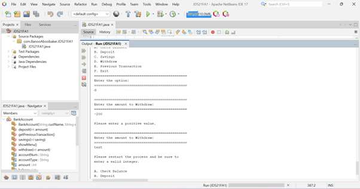

### Demonstrating output clarity
#### Program provides clear instructions for user input:
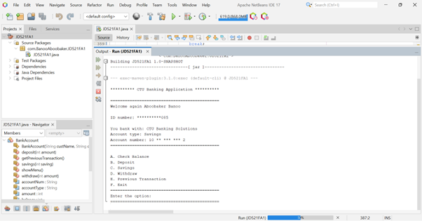

#### Program outputs clear messages for successful deposits:
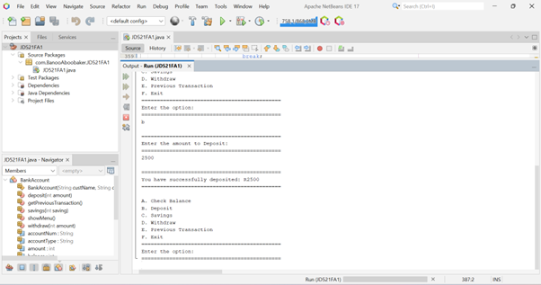

#### Program outputs clear messages for successful savings:
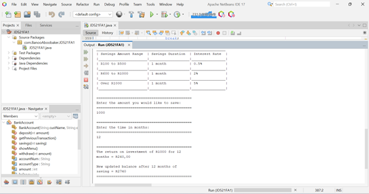

#### Program outputs clear messages for successful withdrawals:
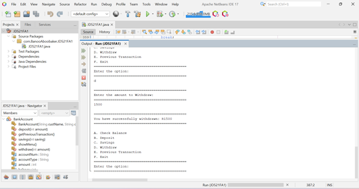

### Demonstrating creativity
#### Program includes additional features beyond the basic requirements
a. With option ‘A’, the user can Check their account balance:  
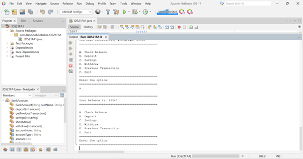

b. With option ‘E’, the use can check their Previous transaction:  
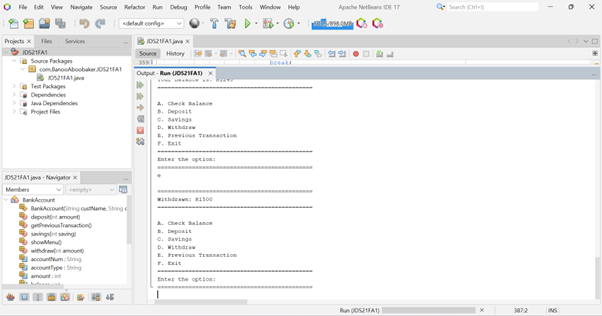

c. Balance starts at R0 (no money in the account):  
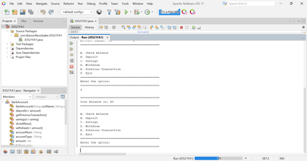

d. The users Previous transaction is null if no transactions have taken place:  
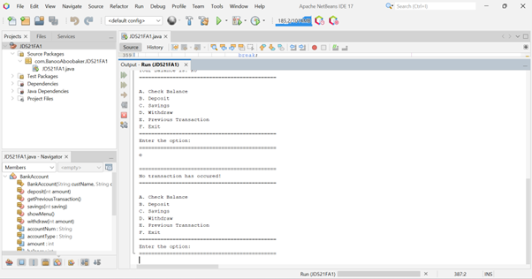
